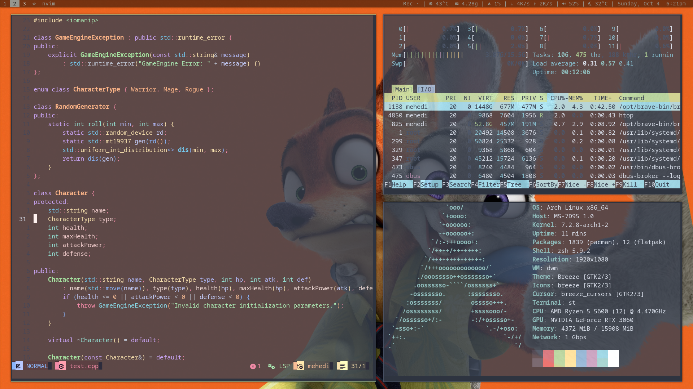

# Mehedi's suckless setup



My personal X11 desktop on Arch Linux, built around **dwm**, **st**, and
**dmenu**. I use it for programming, working in the terminal, and keeping
everyday tasks within a few keyboard shortcuts. The screenshot shows Neovim
editing C++, with htop and Neofetch alongside it.

All three source builds live directly in this repository as regular folders.

## What I use

| Component | My setup |
| --- | --- |
| Operating system | Arch Linux |
| Window manager | dwm 6.5 on X11 |
| Terminal | st 0.9.2 |
| Application launcher | dmenu 5.4, centered on screen |
| Shell | Zsh |
| Editor | Neovim |
| Compositor | Picom, using the XRender backend |
| Status bar | My Bash [dwm-status.sh](dwm/scripts/dwm-status.sh) script |
| Browser | Brave first, with other installed browsers as fallbacks |
| File manager | Thunar |
| Monitoring | htop and Neofetch |

The desktop pictured here runs at **1920 × 1080** on an **AMD Ryzen 5 5600**,
with an **NVIDIA GeForce RTX 3060** and **16 GB RAM**.

## Desktop and appearance

I use nine numbered tags for workspaces, with a top bar showing the active
tags, layout, window title, and system status. The bar has a black background,
muted gray text, and a brighter selected tag. Its configured opacity is about
50%, with Hack and AtkynsonMono Nerd Font Mono at size 10.

The default layout is tiling, with one master window taking 55% of the
available width. Floating, monocle, spiral, and dwindle layouts are also
available. Gaps can be adjusted while working, and terminal swallowing lets
an application launched from st take the terminal's place.

My st build supports transparency, ligatures, scrollback, flexible window
sizing, and Xresources colors. Its compiled defaults use a Nord palette and
95% background opacity; the colors and transparency can be changed for the
running desktop. Picom handles the transparency seen in the screenshot.

dmenu opens in the center of the screen and supports Xresources colors.

## My status bar

The [status script](dwm/scripts/dwm-status.sh) displays:

- Screen recording activity.
- CPU temperature, RAM usage, and CPU usage.
- Live download and upload rates on the active network interface.
- Battery percentage when a battery is present.
- Audio volume or mute state.
- Dhaka weather and temperature.
- The day, date, and time.

System values refresh every three seconds. Weather updates in the background
every 15 minutes. Network rates use transferred bytes, with K/M representing
KiB/MiB per second.

See [Editing the dwm bar](dwm/scripts/README.md) for appearance and status
customization.

## Everyday shortcuts

`Super` is the Windows key.

| Shortcut | Action |
| --- | --- |
| `Super+Return` | Open st |
| `Super+D` | Open dmenu |
| `Super+W` | Open the browser |
| `Super+E` | Open Thunar |
| `Super+N` | Open Neovim in st |
| `Super+Shift+H` | Open htop in st |
| `Super+J` / `Super+K` | Focus the next / previous window |
| `Super+Shift+J` / `Super+Shift+K` | Move a window through the stack |
| `Super+Q` | Close the focused window |
| `Super+1` … `Super+9` | Switch tags |
| `Super+Shift+1` … `Super+Shift+9` | Move the focused window to a tag |
| `Super+T` | Use the tiling layout |
| `Super+Shift+M` | Use the monocle layout |
| `Super+S` | Use the spiral layout |
| `Super+Shift+T` | Use the dwindle layout |
| `Super+F` | Toggle fullscreen |
| `Super+Shift+Space` | Toggle floating for the focused window |
| `Super+Space` | Promote a window to master |
| `Super+-` / `Super+=` | Decrease / increase gaps |
| `Super+Shift+B` | Toggle the bar |
| `Print` / `F6` | Capture the screen / a region |
| `Super+Shift+L` | Lock the screen |
| `Super+Shift+P` | Open the power menu |
| `Super+Ctrl+Shift+Q` | Restart dwm |
| `Super+Shift+Backspace` | Exit dwm |

The full bindings are in [dwm/config.def.h](dwm/config.def.h). Browser,
screenshot, lock, and power shortcuts call helper scripts from my local
desktop setup; those helpers are not included in this folder.

## Build and install

The builds use a C compiler, Make, X11, Xinerama, Xft, Fontconfig, and
FreeType. dwm also links against XRender, X11-XCB, XCB, and XCB-Res. st uses
HarfBuzz and pkg-config. The status script uses Bash, curl, jq, awk, GNU
coreutils, `xsetroot`, and `wpctl` for audio information.

Clone my repository and build each program:

```sh
git clone https://github.com/MehediXT/Mydotfiles.git
cd Mydotfiles/suckless

make -C dwm
make -C st
make -C dmenu
```

Install the builds into `~/.local`:

```sh
make -C dwm install PREFIX="$HOME/.local"
make -C st install PREFIX="$HOME/.local"
make -C dmenu install PREFIX="$HOME/.local"
```

Keep `~/.local/bin` in your `PATH`. dwm runs inside an X11 session. My current
machine starts it through a local `dwm-session` wrapper, which also loads
Xresources, sets the wallpaper, and starts Picom and the status script. That
wrapper is separate from these source builds.

## Files I customize

| File or folder | Purpose |
| --- | --- |
| [dwm/config.def.h](dwm/config.def.h) | Fonts, colors, gaps, layouts, rules, and shortcuts |
| [dwm/config.h](dwm/config.h) | Build configuration, refreshed from `config.def.h` when it changes |
| [dwm/scripts/dwm-status.sh](dwm/scripts/dwm-status.sh) | Status contents, weather location, and refresh timing |
| [st/config.h](st/config.h) | Terminal font, colors, opacity, and shortcuts |
| [dmenu/config.def.h](dmenu/config.def.h) | Launcher font, colors, and centered layout defaults |
| [.local/](.local/) | Binaries, manual pages, and terminfo staged from this machine |
| [install-device.sh](install-device.sh) | Install the staged binaries system-wide and back up existing launchers |

After changing dwm's configuration, rebuild and reinstall it, then restart
dwm with `Super+Ctrl+Shift+Q`. For dmenu, copy changed defaults to its generated
`config.h` before rebuilding an existing build.

## Credits

These are my customized builds, based on suckless software and
BreadOnPenguins' patched builds. Original copyright notices and licenses are
preserved in [dwm/LICENSE](dwm/LICENSE), [st/LICENSE](st/LICENSE), and
[dmenu/LICENSE](dmenu/LICENSE).
